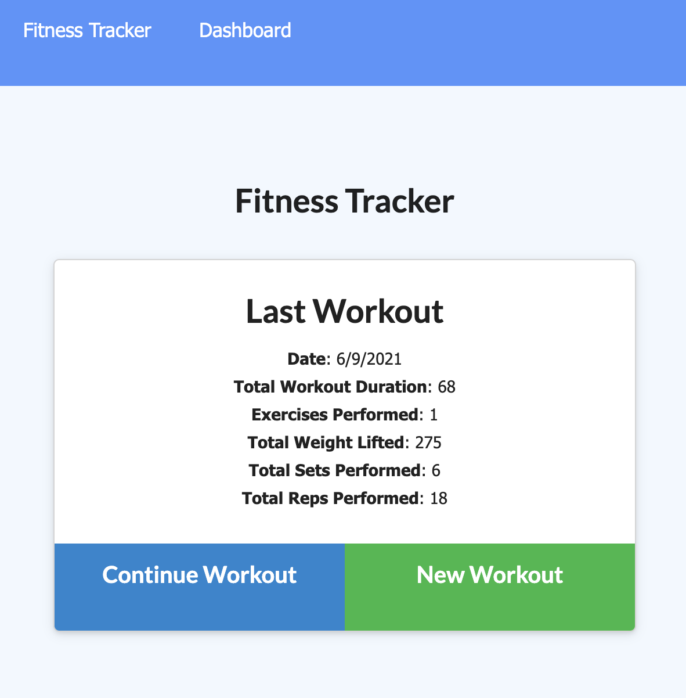

# Fitness Tracker

## Table of Contents
- [Description](#description)
- [Installation](#installation)
- [Usage](#usage)
- [Technology](#technology)

# Description
Fitness Tracker is an application, designed with the health conscious user in mind. It gives the user the ability to closely monitor their fitness journey, by allowing the user to store measurable exercise data, such as weight, sets, reps, and duration. In turn, this information can be used to comparatively track workout performance. 

# Installation
For local installation:

  * clone the Github repository and add it to your local repo via your choice code-editing software (ie Visual Studio Code).

  * Open Integrated Terminal in VS Code and run the following commands:

    * 'npm install'

    * 'npm run seed'

    * 'npm start' 

  * Once the "App running on port 7540" confirmation has been recieved, visit "localhost: 7540" in the internet browser. 

For the deployed version of the application:

  * [click the link] https://fittrack2021.herokuapp.com/

# Usage
This Fitness Tracker application allows health consciouss users to closely monitor their fitness progress. Once the application has been installed and opened, the user is presented with the stats from their most recent workout. 

Thanks to the application's intuitive design, with a few simple clicks, the user will have the ability to:

* Add exercises to the most recent workout plan.

* Add new exercises to a new workout plan.

* View the combined weight of multiple exercises from the past seven workouts on the `stats` page.

* View the total duration of each workout from the past seven workouts on the `stats` page.

Add Workout Stats!

# Technology
This application was made possible with the use of the follow dev tools:
* Node.js
* Express.js
* MongoDb
* Mongoose
* Mongo Atlas
* Heroku